# New Bank
## Pega Constellation

## Vídeo de demonstração

Acesse o Vídeo: [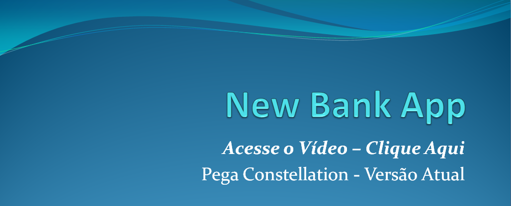](https://youtu.be/s9CjFWR6vxI?si=6bIr2WHoUOrarv76)

## Objetivo

A aplicação New Bank tem como objetivo simular um fluxo bancário básico, organizado de forma simples e modular dentro de um Case Type. Ela permite gerenciar o ciclo completo de um cliente desde a entrada até a movimentação da conta.

## Finalidade

- Abertura de conta ou acesso existente
- Movimentação financeira
- Finalização e continuidade

## Case Type - Conta Bancária

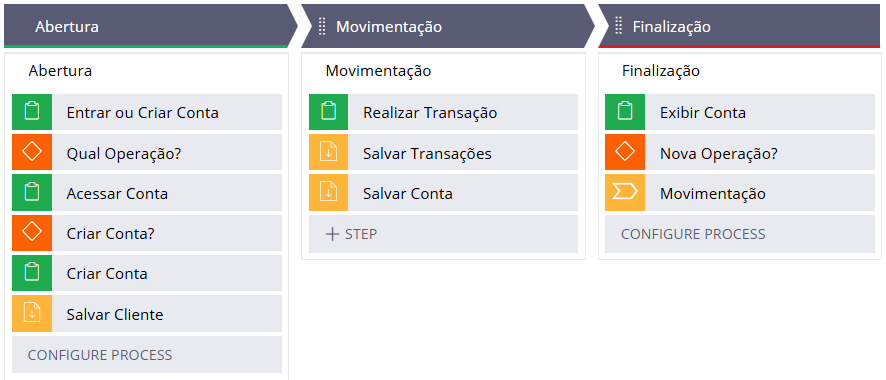

## Status

- Novo (Abertura)
- Em-Processamento (Movimentação)
- Concluído | Resolved-Completed (Finalização)

## Flow - Abertura

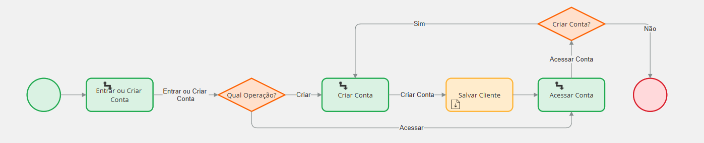

## Flow - Movimentação

## Flow - Finalização

## Principais Propriedades do Case

- Cliente (Data Reference | D_ClienteSavable | Copy)
- Conta (Data Reference  | D_ContaSavable | Copy)
- Transacao (Data Reference | D_TransacaoSavable | Copy)
- Email (Email)
- Senha (Text)
- Saldo (Decimal) Calculate
- SaldoAtual (Decimal)
- Valor (Decimal)
- EscolhaOperação (Picklist: Criar Conta | Acessar Conta)
- NovaOperacao (Boolean)
- TipoOperacao (Text)
- CriarConta (Boolean)

## Data Type

- Cliente
    - ClienteID (Text-line)
    - NomeCompleto (Text-line)
    - Telefone (Phone)
    - Email (Email)
    - Senha (Text-line)

- Transacao
    - TransacaoID (Text-line)
    - Data (Date-only)
    - Tipo (picklist: Depósito | Saque)
    - Valor (Decimal)

- Conta
    - NumeroConta (Text-line)
    - Data (Date-Time)
    - EmailCliente (Text-line)
    - Saldo (Decimal)
    - Cliente (Data Referenca Single Records)
    - Transacoes (Embedded Data List Records)

## Data Pages Savable

- D_ClienteSavable
- D_TransacaoSavable
- D_ContaSavable

        IF pyGUID != ""
            Acessa Lookup
        ELSE
            Acessa Data Transform

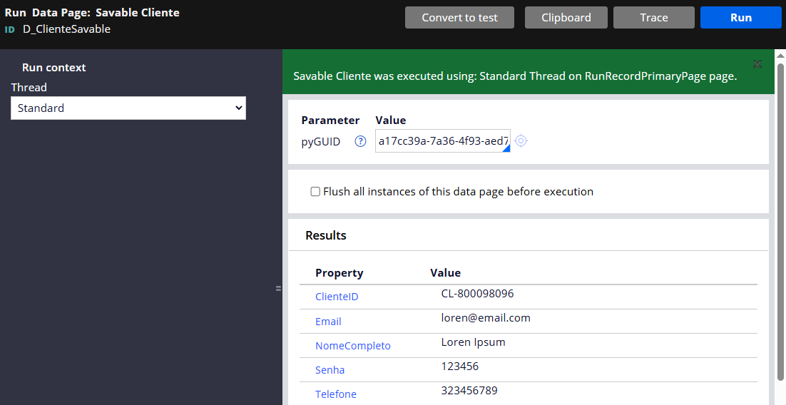

O exemplo mostra a busca pelo pyGUID existente, por exemplo na Data Page "D_ClienteSavable". Neste caso executou o Lookup.

As Data Pages Salváveis possuem duas fontes de dados, Loockup e Data Transform; se o Param.pyGUID for diferente de Vazio, acessa o Loockup; senão o Data Transform. O parâmetro pyGUID foi configurado para não ser obrigatório.

## Data Pages Criadas

### Data Type: Cliente

- D_ClientePorEmailSenha
    - Tipo: List
    - Parâmetro(s): Email e Senha
    - Fonte de dados: Report Definition
    - Ready-only

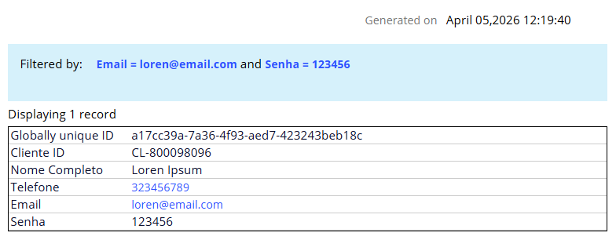

Data Page usada para validar o acesso à conta, solicitando email e senha.

### Data Type: Conta

- D_ContaPorEmailCliente
    - Tipo: List
    - Parâmetro(s): Email
    - Fonte de dados: Report Definition
    - Ready-only

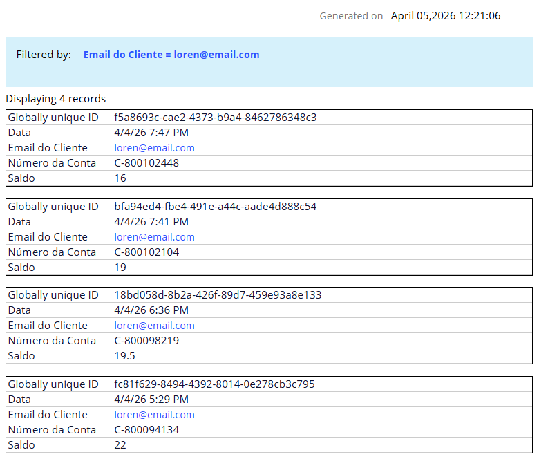

Data Page usada para verificar se a conta existe, fazendo a busca com o email do cliente.

## Pré-Processamento

- Realizar Transações (Data Transform: DT_PreRealizarTransacao)
    - Parâmetro: Email

    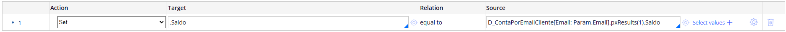

## Pós-Processamento

- Acessar Conta (Data Transform: DT_ValidarCliente)

    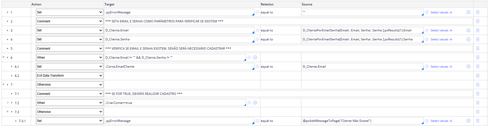

- Realizar Transações (Data Transform: DT_CalcularSaldo)
    - Parâmetro: Email

    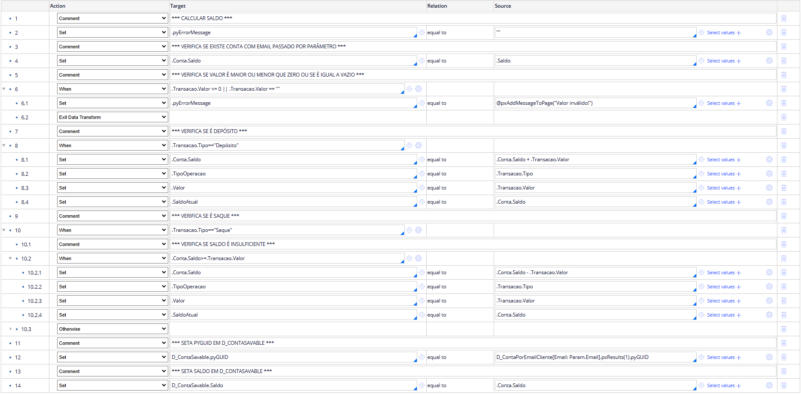

- Exibir Conta (Data Transform: DT_PreExibirConta)

    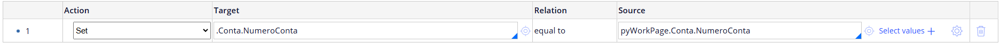

## Stage: Abertura

1. Escolhe a Operação:
    - Criar Conta - Vai para opção 2. Criar Conta
    - Acessar Conta - Vai para opção 3. Acessar Conta

    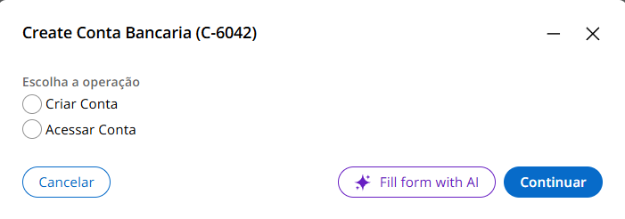

2. Criar Conta:
    - Nome Completo (Text)
    - Telefone (Phone)
    - Email (Email)
    - Senha (Text)

    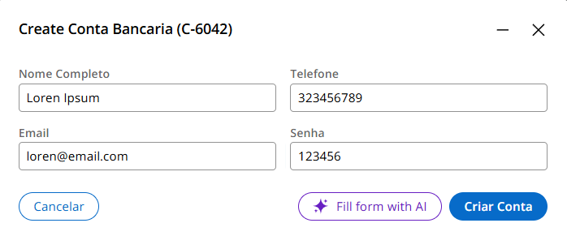

3. Save Data Page (Cliente)     

4. Acessar Conta
    - Email (Email)
    - Senha (Text)
    - Criar Conta (Boolean) Volta para opção 2. Criar Conta

    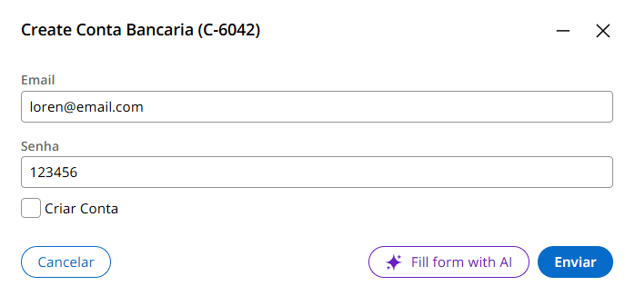

## Stage: Movimentação

1. Realizar Transação:
    - Exibe o email do cliente
    - Exibe o Saldo Atual
    - Tipo (Picklist: Depósito | Saque)
    - Valor (Decimal)

    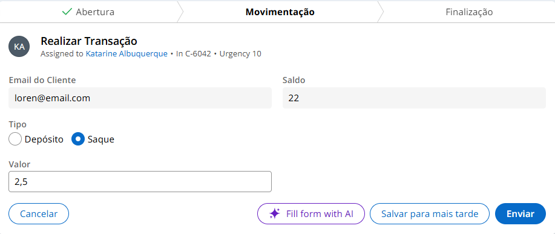

2. Save Data Page (Transação)
3. Save Data Page (Conta)

## Stage: Finalização

1. Exibir Conta
    - Exibe o Email do cliente
    - Exibe o Número da Conta do cliente
    - Exibe o Saldo Atual
    - Exibe o Tipo da operação
    - Exibe o Valor da transação
    - Deseja Realizar Nova Operação?

    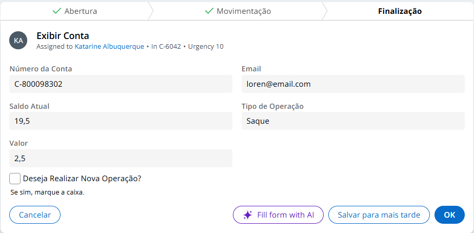

## Contatos

- E-mail: [kba.2879@gmail.com](mailTo:kba.2879@gmail.com)

- Linkedin: [/katarine-albuquerque](https://www.linkedin.com/in/katarine-albuquerque/)